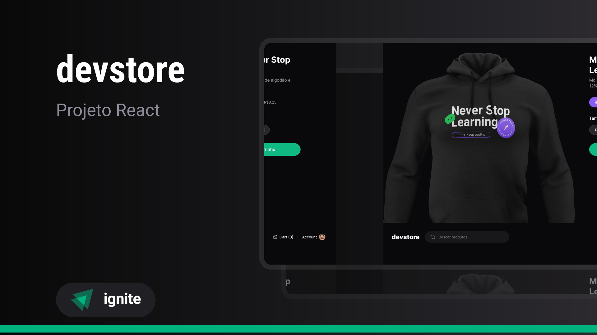

<div align="center">
   <h1>Dev Store</h1>
</div> 

<div align="center">
  <a href="#-Technologies"><b>Technologies</b></a>&nbsp;&nbsp;&nbsp;|&nbsp;&nbsp;&nbsp;
  <a href="#-Project"><b>Project</b></a>&nbsp;&nbsp;&nbsp;|&nbsp;&nbsp;&nbsp;
  <a href="#-Layout"><b>Layout</b></a>&nbsp;&nbsp;&nbsp;
</div>

---

<div align="center">
  
</div> 

<div align="center">
  
</div> 

<br></br>

## 🚀 Getting started

Clone the project and access the folder.

```bash
$ git clone https://github.com/diaspd/dev-store.git
$ cd 
```

## Installation

```bash
$ npm install
```

## Running the app

```bash
$ npm run dev
```

The app will be available on `http://localhost:3000` 

</br>

## Setting the app
To connect to api you will need to create a `.env.local` file and add 

```
NEXT_PUBLIC_API_BASE_URL="https://ignite-devstore-api.vercel.app"
APP_URL="http://localhost:3000"
```

<br></br>

## 💻 Technologies

This project was developed with the following technologies:
<b>
- Nextjs
- TypeScript
- TailwindCss
- Cypress
</b>

</br>

## 📄 Project
💰 Project made to learn new features of next 13 as open graph images, server components, client components, data feching, tests, SSR, SSG and etc.

</br>

## 🔖 Layout
- [Dev Store - Figma](https://www.figma.com/community/file/1299037596397442545)

<br></br>

Made with ♥ by Pedro Dias. 👋 Follow me on social media!</br>

If you can give a little star, I appreciate it 🤩
